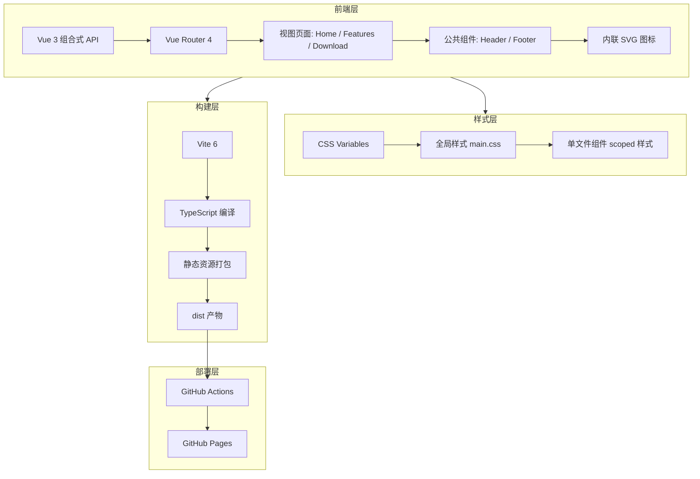

# 觅影 SeekPhoto - 技术架构文档

## 1. 架构设计



## 2. 技术描述

- **前端框架**：Vue 3.5.13 + TypeScript 5.6
- **路由方案**：Vue Router 4.5.0，使用 `createWebHistory`
- **构建工具**：Vite 6.0.5 + `@vitejs/plugin-vue`
- **样式方案**：原生 CSS + CSS Variables，无 UI 组件库
- **图标方案**：内联 SVG，不依赖图标库
- **动画方案**：CSS Keyframes，无动画库
- **部署方式**：GitHub Pages，基础路径 `/seekphoto-site/`
- **CI/CD**：GitHub Actions 自动构建并部署

## 3. 路由定义

| 路由 | 页面组件 | 描述 |
|------|----------|------|
| `/` | Home.vue | 首页，Hero、核心特性、搜索演示、隐私、下载 CTA |
| `/features` | Features.vue | 功能详情页，三大核心功能 + 技术栈 |
| `/download` | Download.vue | 下载页，系统要求、安装指南、FAQ |

## 4. 目录结构

```
website/
├── .github/
│   └── workflows/
│       └── deploy.yml          # GitHub Actions 自动部署
├── src/
│   ├── components/
│   │   └── common/
│   │       ├── Footer.vue      # 页脚组件
│   │       └── Header.vue      # 顶部导航栏
│   ├── styles/
│   │   └── main.css            # 通用样式、按钮、区块标题
│   ├── views/
│   │   ├── Download.vue        # 下载页
│   │   ├── Features.vue        # 功能详情页
│   │   └── Home.vue            # 首页
│   ├── App.vue                 # 根组件 + CSS Variables
│   ├── main.ts                 # 应用入口 + 路由配置
│   └── vite-env.d.ts           # Vite 客户端类型声明
├── index.html                  # HTML 模板
├── package.json                # 项目依赖
├── tsconfig.json               # TypeScript 配置
└── vite.config.ts              # Vite 配置
```

## 5. 核心组件设计

### 5.1 Header.vue
- 固定顶部导航栏
- Logo + 导航链接（首页/功能/下载）
- GitHub 图标外链
- 滚动时显示底部边框和淡阴影
- 浅色半透明毛玻璃背景

### 5.2 Footer.vue
- 品牌信息 + 快速链接
- 单行版权信息
- 更简洁的两栏布局

### 5.3 Home.vue
- **Hero 区域**：居中大标题、徽章、副标题、两个 CTA 按钮
- **核心特性**：3 列卡片，数据硬编码在 `features` 数组
- **搜索演示**：5 个关键词循环打字机效果 + 6 个结果卡片
- **隐私承诺**：三列居中图标 + 标题 + 描述
- **下载 CTA**：渐变卡片 + 白色按钮

### 5.4 Features.vue
- 页面标题区
- 3 个功能详情区块（语义搜索 / 人脸识别 / 时间线）
- 左右两栏布局，使用 `direction: rtl` 实现偶数行反向
- 视觉卡片模拟：搜索栏、人脸网格、时间线列表
- 技术栈网格：6 张技术卡片

### 5.5 Download.vue
- 下载主卡片：版本号、GitHub 下载按钮
- 系统要求：4 列卡片
- 安装指南：4 步流程
- FAQ：4 个问答卡片

## 6. 样式系统

### 6.1 CSS Variables

在 `App.vue` 中定义全局变量：

| 变量名 | 值 | 用途 |
|--------|-----|------|
| `--primary` | `#4f46e5` | 主强调色 |
| `--primary-dark` | `#4338ca` | 悬停强调色 |
| `--primary-light` | `#eef2ff` | 标签/图标背景 |
| `--bg` | `#fafafa` | 页面背景 |
| `--bg-elevated` | `#ffffff` | 卡片背景 |
| `--text-primary` | `#0f172a` | 主文字 |
| `--text-secondary` | `#64748b` | 次要文字 |
| `--text-muted` | `#94a3b8` | 弱化文字 |
| `--border` | `#e2e8f0` | 边框 |
| `--shadow` | `0 1px 3px rgba(...)` | 轻阴影 |
| `--shadow-lg` | `0 10px 40px rgba(...)` | 卡片悬浮阴影 |
| `--radius` | `12px` | 默认圆角 |
| `--radius-lg` | `16px` | 大圆角 |
| `--radius-xl` | `24px` | 超大圆角 |

### 6.2 通用类

在 `main.css` 中定义：
- `.container`：最大宽度 1200px，水平内边距 24px
- `.btn` / `.btn-primary` / `.btn-secondary` / `.btn-large`：按钮变体
- `.section-header` / `.section-label` / `.section-title` / `.section-desc`：区块标题组合
- `.card`：通用卡片样式
- `.page-hero`：页面顶部标题区

## 7. 性能优化

- **路由懒加载**：`component: () => import('./views/xxx.vue')`
- **代码分割**：Vite 自动处理
- **资源压缩**：Vite 生产构建自动压缩 CSS/JS
- **无外部图片**：使用 CSS 渐变块替代真实图片，减少请求
- **Google Fonts**：仅加载 Outfit 和 Noto Sans SC 必需字重

## 8. 浏览器兼容性

- Chrome 90+
- Firefox 88+
- Edge 90+
- Safari 14+

## 9. 部署流程

1. 本地开发：`npm run dev`
2. 本地构建：`npm run build`
3. 推送到 `main` 分支
4. GitHub Actions 自动运行：
   - `actions/checkout@v4` 检出代码
   - `actions/setup-node@v4` 设置 Node.js 20
   - `npm ci` 安装依赖
   - `npm run build` 构建
   - `actions/configure-pages@v4` 配置 Pages
   - `actions/upload-pages-artifact@v3` 上传 `dist`
   - `actions/deploy-pages@v4` 部署到 GitHub Pages
5. 访问地址：`https://aiyo407.github.io/seekphoto-site/`
