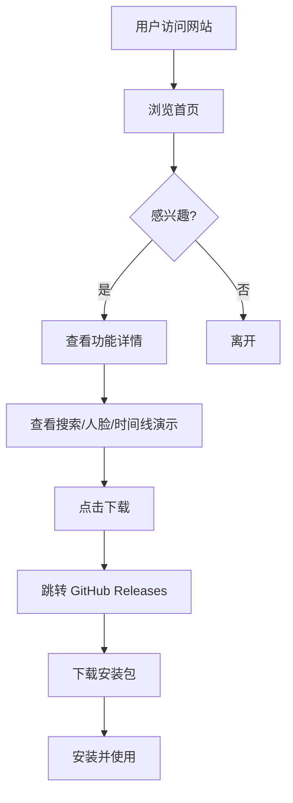

# 觅影 SeekPhoto - GitHub 推广网站 PRD

## 1. 产品概述

**觅影 SeekPhoto** 是一款基于 AI 的本地智能图片搜索管理工具，支持语义搜索、人脸识别、时间线浏览。本推广网站部署于 GitHub Pages，用于展示应用核心特性、功能详情和下载入口，吸引用户下载试用。

- **目标用户**：摄影爱好者、设计师、需要管理大量本地图片的个人用户
- **核心价值**：用自然语言搜索图片、智能人脸分类、本地化隐私保护
- **市场定位**：面向个人用户的桌面端智能图片管理工具

## 2. 核心功能

### 2.1 页面结构

1. **首页 (Home.vue)**：Hero 区域、核心特性展示、语义搜索演示、隐私承诺、下载 CTA
2. **功能详情页 (Features.vue)**：三大核心功能详情、视觉模拟演示、技术栈展示
3. **下载页 (Download.vue)**：安装包下载入口、系统要求、安装指南、常见问题

### 2.2 功能模块

| 页面名称 | 模块名称 | 功能描述 |
|----------|----------|----------|
| 首页 | Hero 区域 | 应用名称、标语「用一句话，找到那张照片」、主视觉、下载与 GitHub 按钮 |
| 首页 | 核心特性 | 三列卡片展示：语义搜索、人脸识别、时间线浏览 |
| 首页 | 搜索演示 | 模拟搜索框打字机效果 + 结果卡片渐显动画 |
| 首页 | 隐私承诺 | 本地存储、无需联网、开源透明三大标签 |
| 首页 | 下载 CTA | Windows 下载入口及版本信息 |
| 功能详情 | 语义搜索 | 中文自然语言搜索、以图搜图、毫秒级检索 |
| 功能详情 | 人脸识别 | 人脸检测、按人物聚合、智能缩略图、隐私本地存储 |
| 功能详情 | 时间线浏览 | EXIF 时间提取、文件名时间戳解析、按年月日分组 |
| 功能详情 | 技术栈 | Tauri 2、Vue 3、Rust、Chinese-CLIP、LanceDB、InsightFace |
| 下载页 | 下载入口 | GitHub Releases 最新版本下载链接 |
| 下载页 | 系统要求 | 操作系统、处理器、内存、存储空间 |
| 下载页 | 安装指南 | 4 步安装流程说明 |
| 下载页 | 常见问题 | 安装提示、联网、支持格式、数据安全 |

## 3. 核心流程

用户访问网站 → 浏览首页 Hero 和特性 → 查看功能详情 → 点击下载 → 跳转 GitHub Releases 下载安装包 → 安装使用

## 4. 用户界面设计

### 4.1 设计风格

- **设计原则**：简约、干净、专业、信息层次清晰
- **主背景**：浅灰白色 `#fafafa`，卡片纯白 `#ffffff`
- **强调色**：靛蓝色 `#4f46e5`，悬停 `#4338ca`
- **辅助色**：浅靛蓝 `#eef2ff` 用于标签和图标背景
- **文字色**：主文字 `#0f172a`，次要文字 `#64748b`，弱化文字 `#94a3b8`
- **边框色**：`#e2e8f0`
- **阴影**：极淡的阴影用于卡片悬浮和导航栏
- **字体**：
  - 中文正文：Noto Sans SC
  - 英文/标题：Outfit
- **按钮风格**：圆角 12px、纯色填充、悬停微上浮
- **布局风格**：大量留白、居中大容器、卡片式布局
- **图标风格**：内联 SVG 线性图标，2px 描边

### 4.2 页面设计概览

| 页面名称 | 模块名称 | UI 元素 |
|----------|----------|---------|
| 首页 | Hero 区域 | 浅色渐变背景、徽章、大标题、副标题、两个 CTA 按钮 |
| 首页 | 核心特性 | 三列网格卡片、图标、标题、描述 |
| 首页 | 搜索演示 | 搜索框 + 6 个渐变色结果方块 + 匹配度百分比 |
| 首页 | 隐私承诺 | 三列居中图标 + 标题 + 描述 |
| 首页 | CTA | 渐变卡片、大按钮、版本说明 |
| 功能详情 | 功能介绍 | 左右两栏布局（文字 + 视觉卡片），奇偶行反向 |
| 功能详情 | 视觉演示 | 搜索结果列、人脸头像网格、时间线列表 |
| 功能详情 | 技术栈 | 6 列技术卡片网格 |
| 下载页 | 下载区域 | 大图标、版本号、下载按钮 |
| 下载页 | 系统要求 | 4 列图标卡片 |
| 下载页 | 安装指南 | 数字序号 + 文字说明的垂直列表 |
| 下载页 | FAQ | 卡片式问答列表 |

### 4.3 响应式设计

- **桌面优先**：最大容器宽度 1200px，三列/四列网格
- **平板适配**：968px 以下功能详情改为单列，特性网格改为 1 列
- **移动端**：768px 以下 Hero 标题缩小、特性单列、下载步骤纵向排列、页脚单列

### 4.4 动效设计

- **搜索演示**：打字机效果循环切换 5 个关键词，光标闪烁
- **结果卡片**：`fadeIn` 动画，按序号递增延迟
- **卡片悬停**：上移 2px、边框加深、阴影出现
- **按钮悬停**：微上移 + 阴影
- **导航栏滚动**：背景透明 → 半透明毛玻璃 + 底部边框

## 5. 内容规划

### 5.1 首页内容

- **Hero 标语**：「用一句话，找到那张照片」
- **核心特性**：
  - 语义搜索：用自然语言描述，AI 理解语义并返回匹配结果
  - 人脸识别：自动检测人脸，按人物聚合分类
  - 时间线浏览：按拍摄时间自动整理，支持 EXIF 提取
- **隐私承诺**：本地存储、无需联网、开源透明

### 5.2 功能详情内容

- **语义搜索**：Chinese-CLIP 模型、中英文混合、场景/物体/颜色/情感理解、以图搜图
- **人脸识别**：InsightFace + YuNet、自动裁剪人脸缩略图、人物分组、本地隐私
- **时间线**：三级优先级时间提取（EXIF → 文件名 → 文件系统时间）
- **技术栈**：Tauri 2、Vue 3、Rust、Chinese-CLIP、LanceDB、InsightFace

### 5.3 下载页内容

- **当前版本**：v0.1.0
- **系统要求**：Windows 10/11 64-bit、双核以上 CPU、4GB+ 内存、500MB 存储
- **安装步骤**：下载 → 运行安装程序 → 配置图片目录 → 开始使用
- **FAQ**：Windows 安全提示、联网需求、支持格式、数据安全

## 6. 技术约束

- **托管平台**：GitHub Pages
- **构建工具**：Vite 6 + Vue 3 + TypeScript
- **部署方式**：静态站点，通过 GitHub Actions 自动构建部署
- **无后端依赖**：纯前端实现，所有数据硬编码在组件中
- **基础路径**：`/seekphoto-site/`
