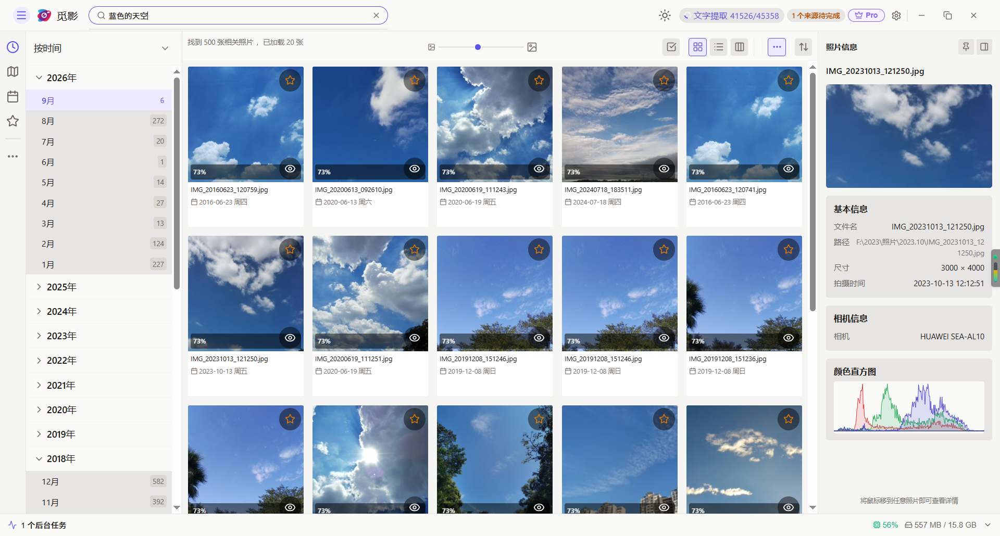

# 觅影 (SeekPhoto) · 本地 AI 图片搜索

<p align="center">
  
  
  
  <a href="https://www.seekphoto.cn"></a>
</p>

<p align="center">
  <strong>万千影像，一觅即中。</strong><br />
  <i>本地 AI 驱动，懂你所想的语义搜图工具 · 100% 本地处理 · 隐私优先</i>
</p>

<p align="center">
  <a href="https://www.seekphoto.cn"><b>🌐 访问官网</b></a> &nbsp;•&nbsp;
  <a href="https://www.seekphoto.cn"><b>⬇️ 下载 Windows 版</b></a> &nbsp;•&nbsp;
  <a href="#-核心功能">核心功能</a> &nbsp;•&nbsp;
  <a href="#-为什么选觅影">为什么选觅影</a> &nbsp;•&nbsp;
  <a href="#-快速开始">快速开始</a>
</p>

<p align="center">
  <i>如果这个项目对你有帮助，欢迎点个 ⭐ Star 支持独立开发～</i>
</p>

---

## 🖼️ 界面预览



---

## 💡 为什么选觅影？

**你的照片，你的隐私，你的电脑。**

觅影是一款**完全本地运行**的 AI 照片搜索与管理工具。无需上传云端，无需联网，所有数据处理都在你的设备上完成。

### 🆚 和其他工具不一样

- **不搬运照片** — 直接在原有文件夹上建索引，照片始终在你熟悉的位置，不必像 Eagle 那样把照片导入库、重新组织目录。
- **本地优先** — 所有 AI 与索引都在本机运行，照片永不离开电脑。
- **比 Electron 更轻** — 基于 Rust + Tauri 构建，内存占用与安装包远小于 Electron 类应用。

### 🎯 它能帮你做什么

✅ **自然语言搜图** - 输入"海滩日落""孩子笑脸"，AI 理解语义并返回结果  
✅ **100% 本地** - 无需联网，照片不上传  
✅ **AI 驱动** - Chinese-CLIP 理解中文语义  
✅ **Rust 高性能** - 相比传统工具，索引和搜索更快  
✅ **Windows 原生** - 专注 Windows 10/11 体验（macOS / Linux 规划中）  

---

## ✨ 核心功能

### 🔍 智能搜索

#### 1️⃣ 文字搜索
用中文描述你想找的照片：
```
"海滩日落"          → 找出所有海滩日落的照片
"孩子笑脸"         → 找出孩子笑的照片
"2023年圣诞节"     → 找出 2023 年圣诞节的照片
"美食照片"         → 找出美食相关的照片
```

#### 2️⃣ 以图搜图
- 选中一张照片
- 点击"相似图片"
- 应用返回视觉相似的照片

#### 3️⃣ 图片文字搜索（OCR）
自动识别照片里出现的文字，让你搜得到"图上的字"：
```
工牌上的姓名、白板上的标题、PPT 截图里的一段话
证件、路牌、海报、贺卡上的文字
中文支持两字以上任意片段匹配
```

---

### 📂 智能管理

#### 1️⃣ 自动标签
AI 自动分析照片内容，生成标签：
```
#风景 #人像 #美食 #建筑 #动物 #夜景 ...
```

#### 2️⃣ 智能分类
AI 自动将照片分类：
```
风景 / 人像 / 美食 / 建筑 / 动物 / 夜景 / 运动 / 旅行 ...
```

#### 3️⃣ 重复检测
- 找出内容相似的照片
- 管理重复照片，释放存储空间

#### 4️⃣ 相册管理
- 创建自定义相册
- 将照片添加到相册
- 导出相册（分享给家人朋友）

---

### 🗺️ 多维浏览

#### 1️⃣ 时间线
- 按时间维度浏览照片
- 快速跳转到某年某月

#### 2️⃣ 地图视图
- 基于照片 GPS 信息，在地图上展示
- 按地点浏览照片

#### 3️⃣ 收藏与标签
- 标记收藏照片
- 添加自定义标签
- 按标签筛选照片

---

## 🚀 技术架构

### 🏗️ 系统架构

觅影采用 **前端 + 后端 + 本地模型** 的架构：

```
┌─────────────────────────────────────────────────────┐
│            Vue 3 前端             │
│       (TypeScript + Vite)          │
└─────────────────────┬───────────────────────┘
                  │ Tauri Commands
┌─────────────────────▼───────────────────────┐
│           Rust 后端                │
│  ┌──────────┐  ┌──────────┐  │
│  │ ML 引擎  │  │ 搜索服务  │  │
│  │(ONNX RT) │  │(LanceDB)  │  │
└─────────────────────┬───────────────────────┘
                  │
┌─────────────────────▼───────────────────────┐
│         本地数据存储               │
│  ┌────────┐  ┌────────┐    │
│  │向量数据库│  │缩略图  │    │
│  └────────┘  └────────┘    │
└─────────────────────────────────────────────────────┘
```

### 🛠️ 技术栈

| 层级 | 技术 | 说明 |
|------|------|------|
| **前端** | Vue 3 + TypeScript + Vite | 现代 Web 技术，响应式 UI |
| **桌面框架** | Tauri 2 | 轻量级，含 AI 模型安装包约 60MB，远小于 Electron 类应用 |
| **后端语言** | Rust | 内存安全，高性能 |
| **搜索模型** | Chinese-CLIP (ViT-B-16) | 中文优化的图文理解模型 |
| **向量数据库** | LanceDB | 快速相似度搜索 |
| **推理引擎** | ONNX Runtime | 支持 CPU/DirectML GPU 加速 |

---

## 📥 下载与安装

### 💻 系统要求

- **操作系统**：Windows 10 / 11（64 位）— macOS / Linux 版本规划中
- **内存**：8GB RAM 及以上（推荐 16GB）
- **磁盘空间**：2GB+（模型首次使用时自动下载，约 720MB）
- **显卡**：可选（DirectML 支持 NVIDIA / AMD / Intel 全系显卡，加速照片索引与图像搜索）

### 📥 下载

#### 从官网下载

1. 访问 [觅影官网](https://www.seekphoto.cn)
2. 点击「免费下载」，获取最新 Windows 安装包 `seekphoto-setup.exe`
3. 双击安装包，按照安装向导完成安装
4. 从开始菜单或桌面快捷方式启动

> 📌 **目前仅提供 Windows 版本**，macOS / Linux 版本规划中，敬请期待。

---

## 🚀 快速开始

### 📝 首次使用指南

1. **启动应用**
   - 安装后，从开始菜单或桌面快捷方式启动

2. **添加照片目录**
   - 进入 **设置 → 目录管理**
   - 点击"添加目录"，选择你的照片文件夹
   - 支持添加多个目录

3. **开始索引**
   - 点击 **"索引照片"** 按钮
   - 应用开始扫描照片，并生成向量
   - 等待进度条到 100%

4. **开始搜索**
   - 在搜索框输入文字，如"海滩日落"
   - 按回车，查看搜索结果
   - 点击照片可查看详情

### 💡 搜索技巧

```
# 基础搜索
"海滩"              → 找出海滩照片
"孩子"              → 找出有孩子的照片

# 组合搜索
"海滩 日落"         → 找出海滩日落的照片
"孩子 笑脸"         → 找出孩子笑的照片

# 时间搜索
"2023年"            → 找出 2023 年的照片
"圣诞节"             → 找出圣诞节的照片

# 以图搜图
1. 选中一张照片
2. 右键 → "查找相似图片"
3. 查看结果
```

---

## 🔒 隐私说明

### 🛡️ 我们的承诺

**觅影完全尊重你的隐私：**

- ✅ **100% 本地处理** - 所有数据在你的设备上处理，无需联网
- ✅ **无数据上传** - 照片和向量数据不会上传到任何服务器
- ✅ **模型本地存储** - AI 模型文件存储在本地，首次使用时从国内镜像（ModelScope / 官网 CDN）下载
- ✅ **无行为跟踪** - 不收集用户行为数据，不进行分析

### 🔍 验证我们的承诺

1. **网络监控** - 应用内置网络流量监控，可查看是否有数据上传
2. **防火墙规则** - 可配置防火墙，阻止应用联网
3. **透明运营** - 我们公开说明数据处理方式（见官网隐私白皮书）

---

## 📂 数据存储

所有用户数据存储在系统用户数据目录：

| 数据 | Windows 路径 |
|------|--------------|
| 模型文件 | `%APPDATA%\seekphoto\models\` |
| 向量数据库 | `%APPDATA%\seekphoto\photo_db\` |
| 缩略图缓存 | `%APPDATA%\seekphoto\thumbnails\` |
| 应用配置 | `%APPDATA%\seekphoto\*.json` |

**数据完全属于你：** 卸载应用后，可选择保留或删除这些数据。

---

## ⚙️ 高级配置

### 推理引擎选择

觅影支持多种推理后端，按优先级自动选择：

| 后端 | 适用硬件 | 配置值 |
|------|---------|--------|
| **DirectML** | NVIDIA / AMD / Intel 显卡 (Windows) | `directml` |
| **CPU** | 所有处理器 | `cpu` |

> GPU 加速仅作用于**图像模型**（照片索引、以图搜图）；关键词搜索使用的文本模型固定走 CPU，延迟仅数十毫秒。

**自动适配**：觅影启动时会按硬件自动选择最优后端并立即生效，无需手动切换。

---

## 🤝 社区

### 💬 参与讨论

- **QQ 用户群** - 群号 `1048754589`，[点击加群](https://qm.qq.com/q/VLdutsMlmU)（Bug 反馈、功能建议、商业合作都来这儿）
- **官网** - [https://www.seekphoto.cn](https://www.seekphoto.cn)

### 🌟 贡献

觅影是闭源的专有软件，源码不对外公开，暂时无法接受外部代码贡献。但非常欢迎：
- 💡 提出功能建议
- 🐛 报告 Bug
- 🌍 翻译界面

---

## 📈 路线图

### ✅ 已完成
- [x] 中文自然语言搜索
- [x] 以图搜图
- [x] OCR 图片文字搜索
- [x] 时间线浏览
- [x] 自动标签与分类
- [x] 地图视图

> 注：早期版本曾提供人脸检测与识别，**当前版本已移除**，相关模型也不再随安装包分发。
> 找人的需求请优先使用 OCR 文字搜索或语义搜索。

### 🚧 进行中
- [ ] 重复照片检测优化
- [ ] 视频文件支持
- [ ] 性能进一步优化

---

## 🙏 致谢

觅影离不开这些优秀的项目：

- [Chinese-CLIP](https://github.com/OFA-Sys/Chinese-CLIP) - 中文图文理解模型
- [Tauri](https://tauri.app/) - 跨平台桌面应用框架
- [Vue 3](https://vuejs.org) - 渐进式 JavaScript 框架
- [ONNX Runtime](https://onnxruntime.ai/) - 高性能推理引擎
- [LanceDB](https://github.com/lancedb/lancedb) - 向量数据库
- [PaddleOCR](https://github.com/PaddlePaddle/PaddleOCR) - 图片文字识别（OCR）

---

## 📞 联系

- **用户交流群**：QQ 群 `1048754589`（[点击加群](https://qm.qq.com/q/VLdutsMlmU)）
- **官网**：https://www.seekphoto.cn

---

## 📄 许可

觅影 (SeekPhoto) 是**专有闭源软件**，源码不对外公开。完整条款见仓库根目录的 [LICENSE](./LICENSE)。

- 可自由下载并使用发布的安装包，免费版永久可用
- Pro 版为一次性买断，无需订阅
- 未获书面授权，不得复制、修改、分发本软件，也不得基于它向第三方提供服务

商业授权、源码访问等合作意向，请加用户交流群（见上方「社区」）。

---

<p align="center">
  <b>如果觅影对你有帮助，欢迎把它推荐给同样需要的朋友，并在 GitHub 上点个 ⭐</b><br />
  <i>由个人开发者用 ❤️ 制作</i>
</p>
